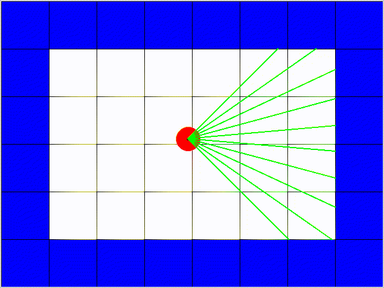

# Reinforcement Learning Simulation

## About

This personal project aims to build a custom environment to train robots to navigate using (Deep) Reinforcement Learning.

For now, the robot structure is quite simple : it can move along the vertical and horizontal axes and holds a simulated laser sensor to detect obstacles.

Then, the robot should be able to communicate with ROS so that its behavior can be transferred to a real robot.
