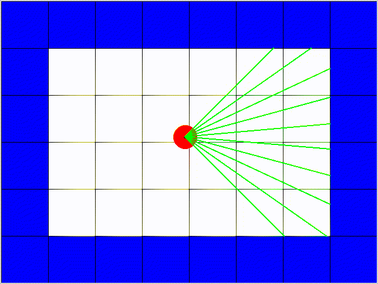

# Reinforcement Learning Simulation

## About

This personal project aims to build a custom environment to train robots to navigate in 2D worlds using (Deep) Reinforcement Learning. It includes reaching a goal position and obstacles avoidance.

For now, the robot structure is quite simple : it can move forward and turn, and holds a simulated laser sensor to detect obstacles.

*Video: Teleoperated robot using directional arrows on the keyboard.*

The simulated robot sends the rays' length of its laser sensor and can receive motion commands. This is a minimal configuration to perform reinforcement learning and allow the robot to navigate autonomously in 2D space.
